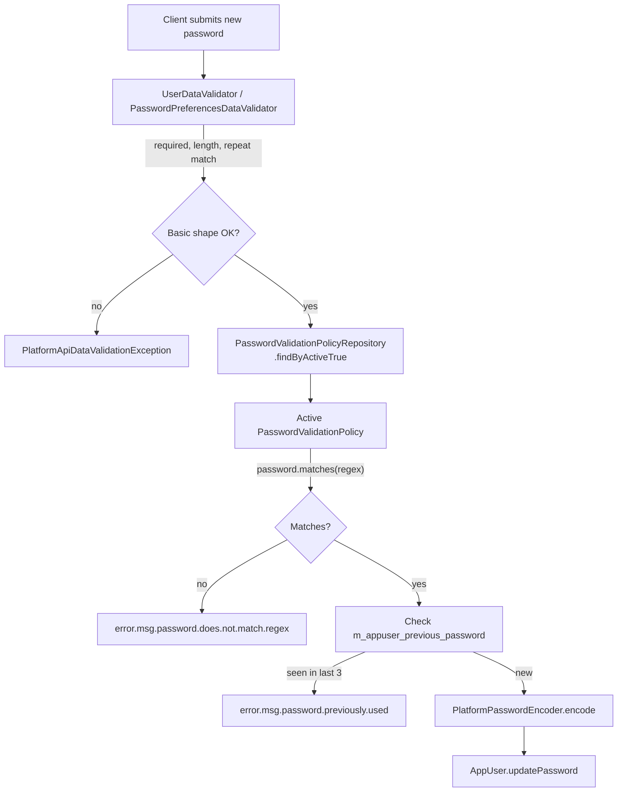

Apache Fineract enforces password complexity through a small catalogue of pre-installed **password validation policies**. Each policy is a `regex + description + active` triple persisted in `m_password_validation_policy`. At any given time exactly one row has `active = true`, and that row's regex is applied to every new or changed password before it is hashed. Clients select a policy via `PUT /v1/passwordpreferences`; there is no API for creating new policies because the tiers ship with the product.

Password complexity is one of three independent password controls in the platform. The other two are touched on at the end of this page so the policy can be understood in context:

- **History** — `m_appuser_previous_password` prevents reuse of the last `numberOfPreviousPasswords = 3` hashes.
- **Expiry** — `m_appuser.last_time_password_updated` is checked by a scheduled job.
- **Reset** — the [forgot-password](/users/forgot-password) flow uses a separate temporary column.

## The `PasswordValidationPolicy` entity

`PasswordValidationPolicy` lives at `fineract-provider/src/main/java/org/apache/fineract/useradministration/domain/PasswordValidationPolicy.java`:

```java
@Entity
@Table(name = "m_password_validation_policy")
public class PasswordValidationPolicy extends AbstractPersistableCustom<Long> {

    @Column(name = "regex",       nullable = false) private String  regex;
    @Column(name = "description", nullable = false) private String  description;
    @Column(name = "active",      nullable = false) private boolean active;

    public PasswordValidationPolicy(final String regex, final String description, final boolean active) {
        this.description = description;
        this.regex = regex;
        this.active = active;
    }
}
```

### Column reference

| Column | Java type | Nullable | Meaning |
| --- | --- | --- | --- |
| `id` | `Long` | no | Primary key. |
| `regex` | `String` | no | Java regular expression. A new password must match end-to-end. |
| `description` | `String` | no | Human-readable rule. Shown by the UI next to the password field. |
| `active` | `boolean` | no | Exactly one row is `true` at any time. |

### Lifecycle methods

The entity only exposes activate / deactivate:

```java
public Map<String, Object> activate() {
    final Map<String, Object> actualChanges = new LinkedHashMap<>(1);
    if (!this.active) {
        actualChanges.put("active", true);
        this.active = true;
    }
    return actualChanges;
}

public void deActivate() {
    this.active = false;
}
```

There is intentionally no `update(regex, description)` — the catalogue is read-only from the API.

## The pre-installed tiers

The seed migration ships several rows in `m_password_validation_policy`, ordered from weakest to strongest. The typical bundle:

| Description | Regex (informal) | Notes |
| --- | --- | --- |
| Simple — 8 chars, any | `.{8,50}` | Minimum length only. Default in dev installs. |
| Medium — alpha + digit, 8+ | requires at least one letter and one digit, 8–50 chars | Sensible default for production. |
| Strong — mixed case + digit + special, 12+ | requires upper, lower, digit, special, 12–50 chars | Recommended for banking deployments. |

The exact regex strings live in the Liquibase changelog under `fineract-provider/src/main/resources/db/changelog`. Custom installs can ship additional rows via their own migration; the API will list them via `/template` but cannot create them.

## How a new password is validated

Whenever a command writes the `password` column — user create, user update with a new password, the dedicated `POST /v1/users/{id}/pwd` endpoint, or the change-password call after a successful temporary-password login — the validator chain looks like this:



`UserDataValidator` and `PasswordPreferencesDataValidator` are the entry points for create / update and policy-toggle respectively. Both load the single active policy via `PasswordValidationPolicyReadPlatformService.retrieveActiveValidationPolicy()` — the same call the read endpoint uses to render the UI hint.

## Password history

After a successful update, the previous BCrypt hash is moved to `m_appuser_previous_password`:

```java
@Entity
@Table(name = "m_appuser_previous_password")
public class AppUserPreviousPassword extends AbstractPersistableCustom<Long> {

    @Column(name = "user_id",      nullable = false) private Long      userId;
    @Column(name = "removal_date") private LocalDate                  removalDate;
    @Column(name = "password",     nullable = false) private String    password;

    public AppUserPreviousPassword(final AppUser user) {
        this.userId = user.getId();
        this.password = user.getPassword().trim();
        this.removalDate = DateUtils.getLocalDateOfTenant();
    }
}
```

The write service inserts a row before overwriting `m_appuser.password`. The change-password validator then compares the new hash against the most recent `AppUserApiConstant.numberOfPreviousPasswords = 3` rows (ordered by `removal_date desc`) and rejects a match. Older rows remain for audit but no longer block reuse.

## REST surface — `/v1/passwordpreferences`

`PasswordPreferencesApiResource` is the only resource that touches the policy:

```java
@Path("/v1/" + PasswordPreferencesApiConstants.RESOURCE_NAME)
@Tag(name = "Password preferences", description = "This API enables management of password policy for user administration.\n"
    + "\n" + "There is no Apache Fineract functionality for creating a validation policy. The validation policies come pre-installed.\n"
    + "\n" + "Validation policies may be updated")
public class PasswordPreferencesApiResource { ... }
```

The shared constants:

```java
public static final String RESOURCE_NAME = "passwordpreferences";
public static final String ENTITY_NAME   = "PASSWORD_PREFERENCES";
public static final String VALIDATION_POLICY_ID = "validationPolicyId";
```

| Method | Path | Operation | Permission |
| --- | --- | --- | --- |
| `GET` | `/v1/passwordpreferences` | Retrieve the active policy | `READ_PASSWORD_PREFERENCES` |
| `PUT` | `/v1/passwordpreferences` | Activate a different policy | `UPDATE_PASSWORD_PREFERENCES` |
| `GET` | `/v1/passwordpreferences/template` | List every policy with its `active` flag | `READ_PASSWORD_PREFERENCES` |

### Retrieve the active policy

```http
GET /api/v1/passwordpreferences
```

The handler:

```java
this.context.authenticatedUser().validateHasReadPermission(PasswordPreferencesApiConstants.ENTITY_NAME);
final PasswordValidationPolicyData passwordValidationPolicyData =
    this.passwordValidationPolicyReadPlatformService.retrieveActiveValidationPolicy();
```

Response — only the three serialised fields:

```json
{ "id": 2, "active": true, "description": "Password must be at least 8 characters, contain a letter and a digit." }
```

The regex itself is **not** returned by `GET` — the description is what the UI displays. The regex is only used server-side.

### List all policies

```http
GET /api/v1/passwordpreferences/template
```

Returns the full catalogue so a UI can render a radio group:

```json
[
  { "id": 1, "active": false, "description": "Simple ..." },
  { "id": 2, "active": true,  "description": "Medium ..." },
  { "id": 3, "active": false, "description": "Strong ..." }
]
```

### Activate a different policy

```http
PUT /api/v1/passwordpreferences
Content-Type: application/json

{ "validationPolicyId": 3 }
```

The body has exactly one field. The write service `PasswordPreferencesWritePlatformServiceJpaRepositoryImpl.updatePreferences` activates the requested row and deactivates whichever row is currently active:

```java
for (PasswordValidationPolicy policy : validationPolicies) {
    if (policy.getId().equals(validationPolicyId)) {
        found = true;
        if (!policy.isActive()) {
            changes = policy.activate();
        }
    } else if (policy.isActive() && !policy.getId().equals(validationPolicyId)) {
        policy.deActivate();
    }
}
if (!found) {
    throw new PasswordValidationPolicyNotFoundException(validationPolicyId);
}
if (!changes.isEmpty()) {
    this.validationRepository.saveAll(validationPolicies);
    this.validationRepository.flush();
}
```

Switching to an unknown id raises `PasswordValidationPolicyNotFoundException`, translated to `404` by the global error mapper. Switching to the already-active policy returns an empty `actualChanges` map and is a no-op.

### Command flow

```mermaid
sequenceDiagram
    autonumber
    participant Admin
    participant API as PasswordPreferencesApiResource
    participant Cmd as CommandWrapperBuilder
    participant Source as PortfolioCommandSource<br/>WritePlatformService
    participant Handler as UpdatePasswordPreferences<br/>CommandHandler
    participant Svc as PasswordPreferencesWrite...Impl
    participant Repo as PasswordValidationPolicyRepository

    Admin->>API: PUT /v1/passwordpreferences {validationPolicyId}
    API->>Cmd: updatePasswordPreferences().withJson(...)
    Cmd-->>API: CommandWrapper
    API->>Source: logCommandSource(wrapper)
    Source->>Handler: dispatch UPDATE_PASSWORD_PREFERENCES
    Handler->>Svc: updatePreferences(command)
    Svc->>Repo: findAll()
    Repo-->>Svc: all policies
    Svc->>Svc: activate target + deActivate previous
    Svc->>Repo: saveAll(); flush()
    Svc-->>Handler: CommandProcessingResult(actualChanges)
    Handler-->>Source: result
    Source-->>API: result + audit row
    API-->>Admin: 200 + result
```

## Validator details

`PasswordPreferencesDataValidator.validateForUpdate(json)` enforces:

- Exactly one parameter — `validationPolicyId`.
- `validationPolicyId` must be a non-null `Long`.
- No unknown fields (uses `unsupported.parameter` strict checking).

Errors are returned as a single `PlatformApiDataValidationException` with one entry per problem.

## Where the regex is applied for ordinary users

The Java code path for user-create:

1. `UsersApiResource.create(json)` builds the `CREATE_USER` command.
2. `UserDataValidator.validateForCreate(json)` checks shape and resolves the active policy.
3. `appUser = AppUser.fromJson(office, staff, roles, command)` — if `sendPasswordToEmail = true`, the platform generates a 13-char random password instead of using the supplied one.
4. `PlatformPasswordEncoder.encode(rawPassword, appUser)` — encoded with BCrypt, then stored.

The same regex check is reapplied on `PUT /v1/users/{id}` when `password` is present, and on `POST /v1/users/{id}/pwd`.

<Note>
The forgot-password flow does **not** run the password through the active policy — it generates a 13-char random temporary password that is guaranteed to satisfy any reasonable regex. The user must subsequently choose a permanent password through `POST /v1/users/{id}/pwd`, and that submission **does** go through the policy.
</Note>

## Operational guidance

| Question | Answer |
| --- | --- |
| How do I roll out a stricter policy? | `PUT /v1/passwordpreferences` with the new id. The change applies to **new** password operations only; existing hashes are not re-evaluated until the user next changes their password (or hits the expiry job). |
| How do I add a custom regex? | Ship a Liquibase changeset that inserts a row into `m_password_validation_policy`. Restart the platform and the row appears in `/template`. |
| How do I disable complexity entirely? | Activate the "Simple" tier — its regex is the most permissive shipped. There is no global "off" switch by design. |
| Does the policy affect technical users (system, admin)? | Yes — the entity makes no distinction. But the seeded admin password set during bootstrap is generated to satisfy the strongest shipped policy. |

## Related pages

<CardGroup cols={2}>
  <Card title="Users" icon="user" href="/users/users">
    Where `password` is actually written on the `AppUser` row.
  </Card>
  <Card title="Forgot Password" icon="envelope" href="/users/forgot-password">
    The reset flow that bypasses the policy by minting a random temporary password.
  </Card>
  <Card title="Overview" icon="compass" href="/users/overview">
    Section landing page.
  </Card>
  <Card title="Permissions" icon="key" href="/users/permissions">
    `PASSWORD_PREFERENCES` is the entity name used by the resource's permission checks.
  </Card>
</CardGroup>

<Tip>
If you operate multiple tenants with different compliance regimes, remember that `m_password_validation_policy` is **per-tenant** — the table lives in each tenant's schema, not in the platform-wide tenants DB. Each tenant can activate a different policy independently.
</Tip>
