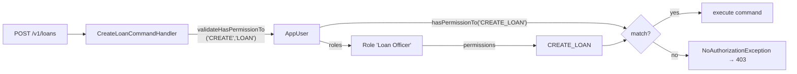
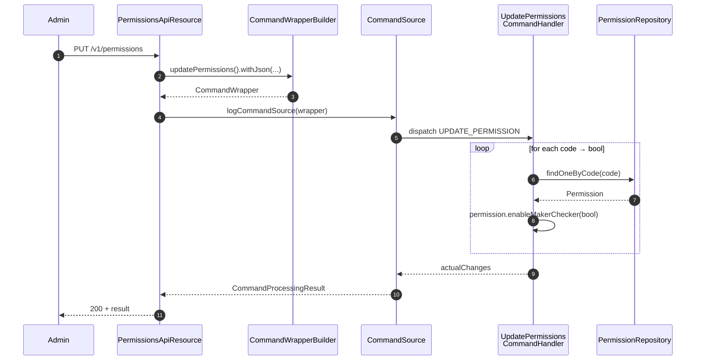

Apache Fineract authorises every request against a flat catalogue of **permissions**, each one identified by a code of the form `ACTION_ENTITY` — `CREATE_LOAN`, `READ_CLIENT`, `UPDATE_OFFICE`, `APPROVE_LOANAPPLICATION`. Permissions are seeded by Liquibase at install time and are not normally created or deleted by clients. They are bound to `Role`s through `m_role_permission` (see [Roles](/users/roles)) and additionally carry a per-permission `can_maker_checker` flag that, when set, routes the corresponding command through the maker-checker pipeline.

This page documents the entity, the naming convention, the grouping convention used for UI rendering, and the read / toggle endpoints exposed by `PermissionsApiResource`.

## The `m_permission` mapping

`Permission` lives at `fineract-core/src/main/java/org/apache/fineract/useradministration/domain/Permission.java`. The full mapping is small enough to inline:

```java
@Entity
@Table(name = "m_permission")
public class Permission extends AbstractPersistableCustom<Long> implements Serializable {

    @Column(name = "grouping",     nullable = false, length = 45)  private String grouping;
    @Column(name = "code",         nullable = false, length = 100) private String code;
    @Column(name = "entity_name",  nullable = true,  length = 100) private String entityName;
    @Column(name = "action_name",  nullable = true,  length = 100) private String actionName;
    @Column(name = "can_maker_checker", nullable = false)          private boolean canMakerChecker;

    public Permission(final String grouping, final String entityName, final String actionName) {
        this.grouping = grouping;
        this.entityName = entityName;
        this.actionName = actionName;
        this.code = actionName + "_" + entityName;
        this.canMakerChecker = false;
    }
}
```

### Column reference

| Column | Java type | Nullable | Meaning |
| --- | --- | --- | --- |
| `id` | `Long` | no | Primary key. |
| `grouping` | `String(45)` | no | UI grouping bucket — e.g. `portfolio`, `transaction_loan`, `authorisation`, `report`. |
| `code` | `String(100)` | no | The wire-level code clients check against. Always `ACTION_ENTITY` upper-case for normal rows. |
| `entity_name` | `String(100)` | yes | The bare entity name — `LOAN`, `CLIENT`, `OFFICE`. Nullable for the wildcard rows that have no entity. |
| `action_name` | `String(100)` | yes | The action — `CREATE`, `READ`, `UPDATE`, `DELETE`, `APPROVE`, …. Nullable for wildcards. |
| `can_maker_checker` | `boolean` | no | When true, the matching command must be confirmed by a checker before it takes effect. |

`code` is **derived** at construction time as `actionName + "_" + entityName`. Wildcard rows (`ALL_FUNCTIONS`, `ALL_FUNCTIONS_READ`, `CHECKER_SUPER_USER`) bypass this convention — they are seeded with `entity_name = null`, `action_name = null`, and a literal `code`.

## The `ACTION_ENTITY` convention

For every domain concept Fineract owns, the seed migration inserts a set of permissions following the same pattern:

| Action | Entity examples | Code |
| --- | --- | --- |
| `READ` | `CLIENT`, `LOAN`, `OFFICE`, `USER`, `ROLE` | `READ_CLIENT`, `READ_LOAN`, ... |
| `CREATE` | same | `CREATE_CLIENT`, `CREATE_LOAN`, ... |
| `UPDATE` | same | `UPDATE_CLIENT`, `UPDATE_LOAN`, ... |
| `DELETE` | same | `DELETE_CLIENT`, `DELETE_LOAN`, ... |
| Domain-specific | `APPROVE`, `DISBURSE`, `REJECT`, `WITHDRAW`, `CLOSE`, `UNDO` | `APPROVE_LOAN`, `DISBURSE_LOAN`, `WITHDRAW_LOANAPPLICATION` |

Every JAX-RS resource that mutates state hands the command framework a wrapper whose `action` and `entity` are exactly the words in the code:

```java
final CommandWrapper commandRequest = new CommandWrapperBuilder()
    .createUser()             // action=CREATE entity=USER  → CREATE_USER
    .withJson(apiRequestBodyAsJson)
    .build();
```

The handler resolves the matching `Permission` row and calls `appUser.validateHasPermissionTo(action, entity)`, which iterates the user's roles and their permissions, comparing case-insensitively:

```java
public boolean hasCode(final String checkCode) {
    return this.code.equalsIgnoreCase(checkCode);
}
```

If no role grants the matching code (and the user has none of the super-user wildcards from [Roles](/users/roles)), a `NoAuthorizationException` is thrown and the response is `403`.



## Groupings

`grouping` is a short tag the UI uses to render permissions in a tree. It is not enforced by the platform — it exists purely for display. Typical values seeded by the demo Liquibase migrations:

| Grouping | Holds |
| --- | --- |
| `special` | The wildcards `ALL_FUNCTIONS`, `ALL_FUNCTIONS_READ`, `CHECKER_SUPER_USER`, `REPORTING_SUPER_USER`. |
| `authorisation` | `READ_USER`, `CREATE_USER`, `UPDATE_USER`, `DELETE_USER`, `READ_ROLE`, `CREATE_ROLE`, … and the `PERMISSIONS_ROLE` bulk grant. |
| `organisation` | `READ_OFFICE`, `CREATE_OFFICE`, `READ_STAFF`, `CREATE_STAFF`, `READ_HOLIDAY`, ... |
| `portfolio` | `READ_CLIENT`, `CREATE_CLIENT`, `READ_GROUP`, `READ_LOAN`, `CREATE_LOAN`, ... |
| `transaction_loan` | `APPROVE_LOAN`, `DISBURSE_LOAN`, `REPAYMENT_LOAN`, `WAIVEINTERESTPORTION_LOAN`, ... |
| `transaction_savings` | `DEPOSIT_SAVINGSACCOUNT`, `WITHDRAWAL_SAVINGSACCOUNT`, `APPROVE_SAVINGSACCOUNT`, ... |
| `accounting` | `READ_GLACCOUNT`, `CREATE_JOURNALENTRY`, `REVERSE_JOURNALENTRY`, ... |
| `report` | One `READ_<reportName>` per stock report. |
| `configuration` | `READ_CONFIGURATION`, `UPDATE_CONFIGURATION`, `READ_CODE`, `READ_HOOK`, ... |

The exact set ships with the database migrations under `fineract-provider/src/main/resources/db/changelog` — search there for `into m_permission`.

## The maker-checker flag

`can_maker_checker` turns ordinary permissions into two-stage approvals. When the flag is on for a code like `CREATE_LOAN`, the command framework records the intent but does not apply it; a second user holding the matching `CHECKER_CREATE_LOAN` permission (or the `CHECKER_SUPER_USER` wildcard) must approve the queued command before the change is persisted.

The toggle is owned by the `Permission` entity:

```java
public boolean hasMakerCheckerEnabled() {
    return this.canMakerChecker;
}

public boolean enableMakerChecker(final boolean canMakerChecker) {
    final boolean isUpdatedValueSame = this.canMakerChecker == canMakerChecker;
    this.canMakerChecker = canMakerChecker;
    return !isUpdatedValueSame;
}
```

The return value of `enableMakerChecker` is the **changed** signal — used by the write service to short-circuit no-op updates and to feed `actualChanges` in the command result.

Read-style permissions (`READ_*`) usually have `can_maker_checker = false` and the platform does not enforce maker-checker on read calls regardless of the flag.

## REST surface — `/v1/permissions`

`PermissionsApiResource` exposes only what makes sense for a pre-installed catalogue: a listing endpoint and a bulk-toggle endpoint for the maker-checker flags. There is no `POST /v1/permissions` and no `DELETE`.

```java
@Path("/v1/permissions")
@Tag(name = "Permissions", description = "An API capability to support management of application permissions for user administration.\n"
    + "\n" + "There is no Apache Fineract functionality for creating or deleting permissions. Permissions come pre-installed.\n"
    + "\n" + "Permissions are not updated, except in the case of enabling or disabling non-read transactions for Maker Checker functionality")
public class PermissionsApiResource { ... }
```

| Method | Path | Operation | Permission |
| --- | --- | --- | --- |
| `GET` | `/v1/permissions` | List all permissions (with `?makerCheckerable=true` to see the flag state) | `READ_PERMISSION` |
| `PUT` | `/v1/permissions` | Toggle the `can_maker_checker` flag on one or more permission codes | `PERMISSIONS_ROLE` |

The serialiser keeps a fixed set of response fields:

```java
private static final Set<String> RESPONSE_DATA_PARAMETERS = new HashSet<>(
    Arrays.asList("grouping", "code", "entityName", "actionName", "selected", "isMakerChecker"));
```

### Listing

```http
GET /api/v1/permissions
```

returns every permission with `selected = true`. The `selected` field is overloaded — the same `PermissionData` DTO is used by `/v1/roles/{id}/permissions`, where `selected` means "is this permission assigned to this role". For a flat list it is always `true`.

```http
GET /api/v1/permissions?makerCheckerable=true
```

switches the read service to `retrieveAllMakerCheckerablePermissions()`. In that mode `selected` carries the value of `can_maker_checker` so a UI can render the flag state directly. From the resource:

```java
if (settings.isMakerCheckerable()) {
    permissions = this.permissionReadPlatformService.retrieveAllMakerCheckerablePermissions();
} else {
    permissions = this.permissionReadPlatformService.retrieveAllPermissions();
}
```

`makerCheckerable=true` also filters out the read-only permissions — there is no point in showing maker-checker toggles for `READ_*` codes.

### Toggling maker-checker

```http
PUT /api/v1/permissions
Content-Type: application/json

{
  "permissions": {
    "CREATE_LOAN":         true,
    "DISBURSE_LOAN":       true,
    "APPROVE_LOAN":        true,
    "CREATE_JOURNALENTRY": false
  }
}
```

The write service iterates the map, loads each `Permission` by code, calls `enableMakerChecker(value)`, and persists only the rows where the flag actually changed. The result payload contains an `actualChanges` map echoing the codes that were updated.



## Code structure in the codebase

```text
fineract-core/.../useradministration/domain/Permission.java       # entity (this page)
fineract-provider/.../useradministration/api/PermissionsApiResource.java
fineract-provider/.../useradministration/domain/PermissionRepository.java
fineract-provider/.../useradministration/service/PermissionReadPlatformServiceImpl.java
fineract-provider/.../useradministration/service/PermissionWritePlatformServiceJpaRepositoryImpl.java
fineract-provider/.../useradministration/handler/UpdatePermissionsCommandHandler.java
```

`PermissionRepository` is a Spring Data interface with a single custom query — `findOneByCode(code)` — plus the standard `findAll`. The write service is responsible for resolving codes to entities and applying `enableMakerChecker`.

## Seeded wildcard permissions

The seed migration installs four codes that are not `ACTION_ENTITY` but are still rows in `m_permission`:

| Code | `grouping` | `entity_name` | `action_name` | Effect |
| --- | --- | --- | --- | --- |
| `ALL_FUNCTIONS` | `special` | `null` | `null` | Bypass every permission check. |
| `ALL_FUNCTIONS_READ` | `special` | `null` | `null` | Bypass every `READ_*` check. |
| `CHECKER_SUPER_USER` | `special` | `null` | `null` | Approve any maker-checker command. |
| `REPORTING_SUPER_USER` | `special` | `null` | `null` | Read every report regardless of `READ_<report>`. |

These rows always have `can_maker_checker = false` — there is no maker-checker pipeline for the wildcards themselves.

## Validation and integrity

- The `PUT` payload must use codes that exist in `m_permission`; unknown codes raise `permission.invalid`.
- Setting `can_maker_checker = true` on a `READ_*` permission is allowed by the entity, but the maker-checker filter ignores it — reads are never queued.
- Code length is capped at 100 chars; the seed data stays well below that.
- The `m_permission` table has no unique constraint on `code` at the schema level — uniqueness is maintained by convention and by the seed scripts. Custom installs that add permissions should follow suit.

<Note>
Because `Permission` does not implement an `update` method beyond `enableMakerChecker`, the platform refuses to rename a code at runtime. The intended workflow is to edit the seed migration and re-bootstrap, then re-grant the new codes to every role.
</Note>

## Related pages

<CardGroup cols={2}>
  <Card title="Roles" icon="users" href="/users/roles">
    How permissions are bundled into roles and the super-user codes.
  </Card>
  <Card title="Users" icon="user" href="/users/users">
    How `AppUser.hasPermissionTo(code)` resolves a check.
  </Card>
  <Card title="Commands framework" icon="bolt" href="/core/commands-framework">
    Where `validateHasPermissionTo` is invoked and how maker-checker queues commands.
  </Card>
  <Card title="Overview" icon="compass" href="/users/overview">
    Section landing page.
  </Card>
</CardGroup>

<Tip>
The cheapest way to discover which permission code a given REST call needs is to run it as a user with no roles — the resulting `NoAuthorizationException` message contains the exact `action + entity` pair the handler asked for.
</Tip>
