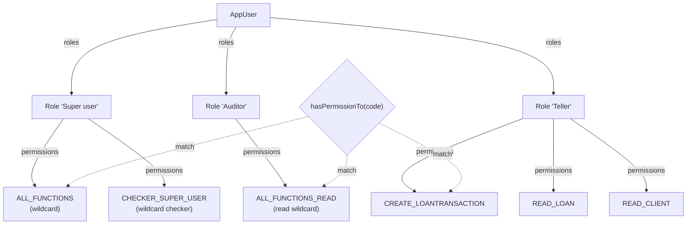
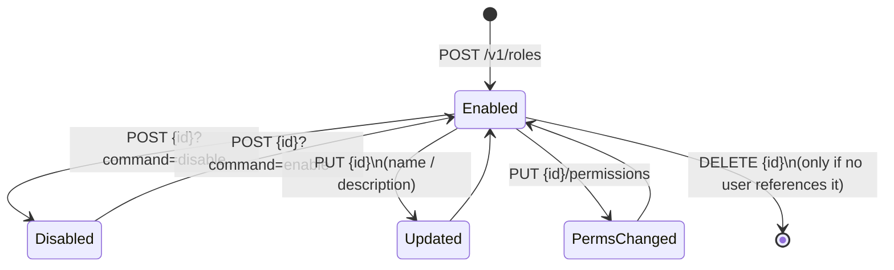

Apache Fineract groups permissions into reusable bundles called **roles**. A role is a named set of `Permission` rows, persisted in `m_role` and joined to `Permission` through `m_role_permission`. `AppUser` references roles through `m_appuser_role` (see [Users](/users/users)), so authorisation always walks `AppUser → Role → Permission` at request time.

This page covers the `Role` entity, the JPA mapping, the per-role `updatePermission` semantics, the enable/disable commands, and the convention that Fineract uses to model "super user" — a set of permission codes that bypass entity-level checks.

## The `m_role` mapping

`Role` lives at `fineract-core/src/main/java/org/apache/fineract/useradministration/domain/Role.java`:

```java
@Entity
@Table(name = "m_role",
       uniqueConstraints = { @UniqueConstraint(columnNames = { "name" }, name = "unq_name") })
public class Role extends AbstractPersistableCustom<Long> implements Serializable {

    @Column(name = "name", unique = true, nullable = false, length = 100)
    private String name;

    @Column(name = "description", nullable = false, length = 500)
    private String description;

    @Column(name = "is_disabled", nullable = false)
    private Boolean disabled;

    @ManyToMany(fetch = FetchType.EAGER)
    @JoinTable(name = "m_role_permission",
               joinColumns = @JoinColumn(name = "role_id"),
               inverseJoinColumns = @JoinColumn(name = "permission_id"))
    private Set<Permission> permissions = new HashSet<>();
}
```

### Column reference

| Column | Java type | Nullable | Meaning |
| --- | --- | --- | --- |
| `id` | `Long` | no | Primary key from `AbstractPersistableCustom`. |
| `name` | `String(100)` | no | Unique role name (`unq_name`). Stored trimmed. |
| `description` | `String(500)` | no | Free-text description. Stored trimmed. |
| `is_disabled` | `Boolean` | no | When true, the role is shown read-only and refused as part of a user's `roles` list. |

The join table `m_role_permission(role_id, permission_id)` is fetched eagerly because permission checks must succeed within the same Hibernate session as the authentication call — there is no second query for permissions during normal request handling.

## Construction and update

`Role` has exactly one public constructor and a JSON factory:

```java
public static Role fromJson(final JsonCommand command) {
    final String name = command.stringValueOfParameterNamed("name");
    final String description = command.stringValueOfParameterNamed("description");
    return new Role(name, description);
}

public Role(final String name, final String description) {
    this.name = name.trim();
    this.description = description.trim();
    this.disabled = false;
}
```

`update(JsonCommand)` only mutates the name and description, producing an `actualChanges` map for the command result:

```java
public Map<String, Object> update(final JsonCommand command) {
    final Map<String, Object> actualChanges = new LinkedHashMap<>(7);
    if (command.isChangeInStringParameterNamed("name", this.name)) {
        final String newValue = command.stringValueOfParameterNamed("name");
        actualChanges.put("name", newValue);
        this.name = newValue;
    }
    if (command.isChangeInStringParameterNamed("description", this.description)) {
        final String newValue = command.stringValueOfParameterNamed("description");
        actualChanges.put("description", newValue);
        this.description = newValue;
    }
    return actualChanges;
}
```

Permissions are not updated by `update` — they have their own dedicated endpoint (see below).

## Permission assignment

The role owns the join. To add or remove a permission, call `updatePermission` per row:

```java
public boolean updatePermission(final Permission permission, final boolean isSelected) {
    boolean changed = false;
    if (isSelected) {
        changed = addPermission(permission);
    } else {
        changed = removePermission(permission);
    }
    return changed;
}

private boolean addPermission(final Permission permission) {
    return this.permissions.add(permission);
}

private boolean removePermission(final Permission permission) {
    return this.permissions.remove(permission);
}
```

The boolean return value is what `Set.add` / `Set.remove` returns — `true` only if the membership actually changed. The write service uses it to build a delta for the audit log.

Two read helpers complete the contract:

```java
public Collection<Permission> getPermissions() { return this.permissions; }

public boolean hasPermissionTo(final String permissionCode) {
    for (final Permission permission : this.permissions) {
        if (permission.hasCode(permissionCode)) {
            return true;
        }
    }
    return false;
}
```

`AppUser.hasPermissionTo(code)` calls into this on every role the user holds.

## Enable / disable

A role is disabled in place — there is no delete-while-in-use. The two mutators are symmetric:

```java
public void disableRole()  { this.disabled = true;  }
public void enableRole()   { this.disabled = false; }
public Boolean isDisabled() { return this.disabled; }
```

The semantics are enforced higher up:

- The `DELETE` endpoint refuses if any active `AppUser` still references the role.
- Disabling a role does not strip it from existing users (so re-enabling restores access exactly), but the user-create / user-update validators reject disabled role ids.

## REST surface — `/v1/roles`

`RolesApiResource` (provider) implements the standard CRUD plus the permission sub-resource:

| Method | Path | Operation | Permission |
| --- | --- | --- | --- |
| `GET` | `/v1/roles` | List roles | `READ_ROLE` |
| `POST` | `/v1/roles` | Create a role | `CREATE_ROLE` |
| `GET` | `/v1/roles/{roleId}` | Retrieve a role | `READ_ROLE` |
| `POST` | `/v1/roles/{roleId}?command=enable` | Re-enable a disabled role | `ENABLE_ROLE` |
| `POST` | `/v1/roles/{roleId}?command=disable` | Disable a role | `DISABLE_ROLE` |
| `PUT` | `/v1/roles/{roleId}` | Update name / description | `UPDATE_ROLE` |
| `GET` | `/v1/roles/{roleId}/permissions` | List the role's permissions (with `selected` flags) | `READ_ROLE` / `READ_PERMISSION` |
| `PUT` | `/v1/roles/{roleId}/permissions` | Bulk-assign permissions | `PERMISSIONS_ROLE` |
| `DELETE` | `/v1/roles/{roleId}` | Delete a role (only if no users reference it) | `DELETE_ROLE` |

### Create

```http
POST /api/v1/roles
Content-Type: application/json

{
  "name": "Branch Manager",
  "description": "Approves loan disbursals and views all branch reports."
}
```

The handler calls `Role.fromJson(command)` and `RoleRepository.save(role)`. The new row is created with `is_disabled = false`.

### The enable / disable command

The single `POST /v1/roles/{roleId}` endpoint dispatches on `?command=`:

```java
if (is(commandParam, DISABLE)) {
    final CommandWrapper commandRequest = builder.disableRole(roleId).build();
    result = this.commandsSourceWritePlatformService.logCommandSource(commandRequest);
} else if (is(commandParam, ENABLE)) {
    final CommandWrapper commandRequest = builder.enableRole(roleId).build();
    result = this.commandsSourceWritePlatformService.logCommandSource(commandRequest);
}
```

Both go through `PortfolioCommandSourceWritePlatformService` so they are auditable and can be intercepted by maker-checker.

### Assign permissions

The permission sub-resource is bulk-update only. The client first calls `GET /v1/roles/{roleId}/permissions` to receive every available permission with a `selected` flag, mutates the flags, and `PUT`s the whole list back:

```http
PUT /api/v1/roles/{roleId}/permissions
Content-Type: application/json

{
  "permissions": {
    "READ_CLIENT":   true,
    "CREATE_CLIENT": true,
    "UPDATE_CLIENT": false,
    "DELETE_CLIENT": false
  }
}
```

The server walks the map, looks each code up via `PermissionRepository`, and calls `role.updatePermission(permission, isSelected)` for every entry. Codes that aren't actually changing are skipped (because `Set.add`/`Set.remove` returns `false`).

### Delete

`DELETE /v1/roles/{roleId}` checks the user-role join. Any reference from a non-deleted `AppUser` aborts the delete with a translated `PlatformDataIntegrityException`. Successful deletes hard-remove the `m_role` row plus its `m_role_permission` entries.

## The "super user" convention

Fineract does not have a `superuser` boolean. Instead, three permission codes act as **wildcards** — if a role grants any of them, the corresponding entity-level check is bypassed:

| Code | Effect |
| --- | --- |
| `ALL_FUNCTIONS` | Grants every action on every entity. Anchors the seeded "Super user" role bundled with the demo data. |
| `ALL_FUNCTIONS_READ` | Grants every `READ_*` action. Useful for read-only auditors. |
| `CHECKER_SUPER_USER` | Lets the user approve any maker-checker command, regardless of the specific `CHECKER_*` permission. |

You can see the codes used directly in `AppUser`:

```java
public boolean hasNotPermissionForReport(final String reportName) {
    return hasNotPermissionForAnyOf(
        "ALL_FUNCTIONS", "ALL_FUNCTIONS_READ",
        "REPORTING_SUPER_USER", "READ_" + reportName);
}

public void validateHasCheckerPermissionTo(final String checkerPermissionName) {
    if (hasNotPermissionTo("CHECKER_SUPER_USER") && hasNotPermissionTo(checkerPermissionName)) {
        throw new NoAuthorizationException("User has no authority to ..." + checkerPermissionName);
    }
}
```

A "Super user" role in the seed data is just an ordinary `Role` named `Super user` whose permission set is `{ ALL_FUNCTIONS, CHECKER_SUPER_USER }`. Removing those codes from the role demotes it without any schema change.



## Repository

`RoleRepository` (provider) is a standard Spring Data interface:

- `Role findOneByName(String name)` — used by validators that resolve role names from bulk-import.
- `List<Role> findAllById(Iterable<Long> ids)` — used by `AppUser`'s create / update path to materialise the requested role set.
- Standard `save`, `delete`, `findById`.

`RoleDataValidator` enforces the JSON shape — `name` required and unique (the database has the constraint, but the validator returns a friendlier error), `description` required, and the `permissions` map only present on the dedicated sub-resource.

## Lifecycle summary



## Validation rules

| Field | Constraint |
| --- | --- |
| `name` | Required, 1–100 chars, unique. Trimmed. |
| `description` | Required, 1–500 chars. Trimmed. |
| `permissions` (sub-resource) | Map of `code → boolean`. Unknown codes are rejected with `permission.invalid`. |
| Disable | Allowed only if no active user has this role assigned. |
| Delete | Allowed only if `m_appuser_role` has no rows pointing at this role. |

<Note>
A user with only disabled roles still authenticates — the security context simply produces an empty effective permission set, so every entity check fails. Disabling is therefore a way to "soft-lock" a user's access without touching `m_appuser`.
</Note>

## Related pages

<CardGroup cols={2}>
  <Card title="Permissions" icon="key" href="/users/permissions">
    The `Permission` entity and the `ACTION_ENTITY` code convention used here.
  </Card>
  <Card title="Users" icon="user" href="/users/users">
    How `AppUser` maps onto roles and uses `hasPermissionTo(code)`.
  </Card>
  <Card title="Overview" icon="compass" href="/users/overview">
    Section landing page.
  </Card>
  <Card title="User admin core" icon="cube" href="/core/user-administration-core">
    Companion view from `fineract-core`.
  </Card>
</CardGroup>

<Tip>
If you are designing custom roles, prefer narrow per-action permissions over `ALL_FUNCTIONS`. The wildcard codes were retained for compatibility with the original mifos seed data — they make audit logs much harder to interpret than per-action grants.
</Tip>
