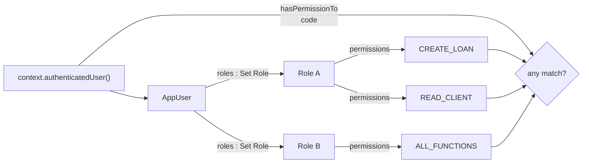

Apache Fineract represents every interactive operator and every system identity as an `AppUser` — a JPA entity in `fineract-core` mapped to the `m_appuser` table. A user is uniquely identified by a `username`, carries a BCrypt-hashed `password`, is anchored to exactly one `Office`, may optionally be linked to a `Staff` record, and is granted permissions transitively through a many-to-many mapping onto `Role`. The same entity also tracks the failed-login counter, the temporary-password column used by the forgot-password flow, and the flags that drive the password-expiry job.

This page documents the entity field by field, walks through the create / update / change-password / delete commands, and lists the `/v1/users` JAX-RS surface that exposes them.

## The `m_appuser` mapping

`AppUser` lives at `fineract-core/src/main/java/org/apache/fineract/useradministration/domain/AppUser.java`. The class signature and a few representative annotations:

```java
@Entity
@Table(name = "m_appuser",
       uniqueConstraints = @UniqueConstraint(columnNames = { "username" }, name = "username_org"))
public class AppUser extends AbstractPersistableCustom<Long> implements PlatformUser {

    @Column(name = "email",    nullable = false, length = 100) private String email;
    @Column(name = "username", nullable = false, length = 100) private String username;
    @Column(name = "firstname", nullable = false, length = 100) private String firstname;
    @Column(name = "lastname",  nullable = false, length = 100) private String lastname;
    @Column(name = "password",  nullable = false)               private String password;

    @ManyToOne @JoinColumn(name = "office_id", nullable = false) private Office office;
    @ManyToOne @JoinColumn(name = "staff_id",  nullable = true)  private Staff  staff;

    @ManyToMany(fetch = FetchType.EAGER)
    @JoinTable(name = "m_appuser_role",
        joinColumns = @JoinColumn(name = "appuser_id"),
        inverseJoinColumns = @JoinColumn(name = "role_id"))
    private Set<Role> roles;
    ...
}
```

It implements `PlatformUser` (from `fineract-security`) so that the `TenantAwareJpaPlatformUserDetailsService` can adapt it straight into a Spring Security `UserDetails`.

### Column reference

The complete column set, from the JPA declarations:

| Column | Java type | Nullable | Meaning |
| --- | --- | --- | --- |
| `email` | `String(100)` | no | Contact email. Must be unique enough to support `findActiveUserByEmail` for the forgot-password flow. |
| `username` | `String(100)` | no | Login name. Unique per the `username_org` constraint. |
| `firstname` | `String(100)` | no | First name. |
| `lastname` | `String(100)` | no | Last name. |
| `password` | `String` | no | BCrypt hash of the current permanent password. Encoded via `PlatformPasswordEncoder`. |
| `nonexpired` | `boolean` | no | Spring Security `accountNonExpired`. |
| `nonlocked` | `boolean` | no | Spring Security `accountNonLocked`. |
| `failed_login_attempts` | `int` | no | Counter incremented on bad-credentials events. |
| `is_login_retries_enabled` | `boolean` | no | When true, repeated failures lock the account. |
| `nonexpired_credentials` | `boolean` | no | Spring Security `credentialsNonExpired`. |
| `enabled` | `boolean` | no | Account is active. Set to `false` on soft-delete. |
| `firsttime_login_remaining` | `boolean` | no | True until the user has changed their initial password. |
| `is_deleted` | `boolean` | no | Soft-delete flag. Hides the user from queries. |
| `office_id` | FK `Office` | no | Branch / office the user belongs to. |
| `staff_id` | FK `Staff` | yes | Optional link to a `m_staff` row for officer attribution. |
| `last_time_password_updated` | `LocalDate` | yes | Drives the password-expiry job. |
| `password_never_expires` | `boolean` | no | When true, the expiry job skips this user. |
| `cannot_change_password` | `Boolean` | yes | When true, `updatePassword` throws `NoAuthorizationException`. |
| `password_reset_required` | `boolean` | no | When true, the security context blocks calls other than change-password. |
| `temporary_password` | `String` | yes | BCrypt hash of a short-lived temp password — see [Forgot Password](/users/forgot-password). |
| `temporary_password_expiry_time` | `OffsetDateTime` | yes | UTC expiry of the temp password (1 h after issue). |
| `is_password_reset_enabled` | `boolean` | no | When false, `ForgotPasswordService` silently ignores requests for this user. |

The user-to-role join lives in `m_appuser_role(appuser_id, role_id)` and is fetched eagerly so authorisation can be evaluated on every request without an extra round trip.

## Object construction

There is exactly one public constructor and one static factory:

```java
public static AppUser fromJson(final Office userOffice, final Staff linkedStaff,
                               final Set<Role> allRoles, final JsonCommand command) {
    final String username = command.stringValueOfParameterNamed("username");
    String password = command.stringValueOfParameterNamed("password");
    final Boolean sendPasswordToEmail =
        command.booleanObjectValueOfParameterNamed("sendPasswordToEmail");

    if (sendPasswordToEmail) {
        password = new RandomPasswordGenerator(13).generate();
    }
    ...
}
```

Key behaviours encoded in `fromJson`:

- If `sendPasswordToEmail = true`, the supplied `password` is **ignored** and replaced by a 13-character `RandomPasswordGenerator` value. The platform then emails it to the user.
- `passwordNeverExpire` defaults to `false` and is read from `AppUserConstants.PASSWORD_NEVER_EXPIRES` if present.
- A user is created with `enabled = true`, `accountNonLocked = true`, `accountNonExpired = true`, `credentialsNonExpired = true`, and `firstTimeLoginRemaining = true`.
- `cannotChangePassword` is forced to `false` at create time.
- `loginRetryLimitEnabled` reads `AppUserConstants.IS_LOGIN_RETRIES_ENABLED`.
- `isPasswordResetAllowed` reads `AppUserConstants.IS_PASSWORD_RESET_ALLOWED`.

The factory delegates to the constructor with a Spring Security `User` carrying the user's flags:

```java
final User user = new User(username, password,
    userEnabled, userAccountNonExpired, userCredentialsNonExpired, userAccountNonLocked,
    authorities);
final AppUser appUser = new AppUser(userOffice, user, allRoles,
    email, firstname, lastname, linkedStaff,
    passwordNeverExpire, cannotChangePassword);
```

## Role mapping

Roles are owned by `AppUser` via the join table — adding or removing a role mutates the `Set<Role> roles` collection and persists on flush. The relevant mutators on `AppUser`:

```java
public void updateRoles(final Set<Role> allRoles) {
    if (!allRoles.isEmpty()) {
        this.roles.clear();
        this.roles.addAll(allRoles);
    }
}
```

The set is `FetchType.EAGER` because every request needs the user's roles to evaluate authorisation. The collection is **replaced wholesale** on update — the API accepts a list of `roleIds` and the write service materialises them via `RoleRepository.findAllById(...)` before calling `updateRoles`.

Authorisation walks the graph at call time:



The convenience checks live on `AppUser`:

- `hasPermissionTo(code)` — true if any role grants `code` (case-insensitive).
- `hasNotPermissionForAnyOf(codes...)` — used to short-circuit super-user checks like `ALL_FUNCTIONS`.
- `validateHasPermissionTo(action, entity)` — called by command handlers; throws `NoAuthorizationException` on miss.

## Soft-delete and disable

There is no hard delete. `AppUser.delete()` flips two flags and refuses on the well-known `system` account:

```java
public void delete() {
    if (isSystemUser()) {
        throw new NoAuthorizationException(
            "User configured as the system user cannot be deleted");
    }
    this.deleted = true;
    this.enabled = false;
}
```

Subsequent reads filter on `deleted = false` (see the `AppUserRepository` query at the bottom of this page), so the row is invisible from the API and from `findByUsernameAndDeletedAndEnabled` used by the security context, but it remains for foreign-key integrity (audit rows, loan officer attribution, etc.).

Disabling without deleting is done by setting `enabled = false`. The `system` user (id `2`) is hard-coded in `AppUserConstants.SYSTEM_USER_NAME = "system"` and `SYSTEM_USER_ID = 2L`; the seeded super-admin is `admin` (`ADMIN_USER_ID = 1L`).

## Password management on the entity

Three independent mechanisms touch the password column:

- `updatePassword(JsonCommand command, PlatformPasswordEncoder encoder)` is called by the change-password command. It refuses if `cannotChangePassword == true`, otherwise re-encodes and stores the value.
- `updatePassword(String encoded)` is the low-level setter, also called after a successful temporary-password login when the user picks a new permanent password.
- `updateTemporaryPassword(String encoded, OffsetDateTime expiry)` is called by `ForgotPasswordServiceImpl` and only writes the two `temporary_password*` columns.

Updating the permanent password clears the temp:

```java
public void updatePassword(final String encodePassword) {
    if (Boolean.TRUE.equals(cannotChangePassword)) {
        throw new NoAuthorizationException("Password of this user may not be modified");
    }
    this.password = encodePassword;
    clearTemporaryPassword();
    this.firstTimeLoginRemaining = false;
    this.lastTimePasswordUpdated = DateUtils.getBusinessLocalDate();
}
```

`lastTimePasswordUpdated` is what the password-expiry job inspects.

## REST surface — `/v1/users`

`UsersApiResource` (`fineract-provider`) exposes the standard CRUD plus password change and a bulk-import pair. All response payloads are filtered through:

```java
private static final Set<String> RESPONSE_DATA_PARAMETERS = new HashSet<>(Arrays.asList(
    "id", "officeId", "officeName", "username", "firstname", "lastname",
    "email", "allowedOffices", "availableRoles", "selectedRoles", "staff"));
```

| Method | Path | Operation | Permission |
| --- | --- | --- | --- |
| `GET` | `/v1/users` | List all users | `READ_USER` |
| `GET` | `/v1/users/{userId}` | Retrieve one (add `?template=true` for editable form data) | `READ_USER` |
| `GET` | `/v1/users/template` | Empty user template + dropdowns | `READ_USER` |
| `POST` | `/v1/users` | Create a user | `CREATE_USER` |
| `PUT` | `/v1/users/{userId}` | Update a user | `UPDATE_USER` |
| `POST` | `/v1/users/{userId}/pwd` | Change the user's password | `UPDATE_USER` |
| `DELETE` | `/v1/users/{userId}` | Soft-delete | `DELETE_USER` |
| `GET` | `/v1/users/downloadtemplate` | Bulk-import Excel template | `READ_USER` |
| `POST` | `/v1/users/uploadtemplate` | Bulk-import Excel upload | `CREATE_USER` |

### Create

```http
POST /api/v1/users
Content-Type: application/json

{
  "username": "alice",
  "firstname": "Alice",
  "lastname": "Smith",
  "email": "alice@example.com",
  "officeId": 1,
  "staffId": 17,
  "roles": [2, 5],
  "sendPasswordToEmail": true,
  "passwordNeverExpires": false,
  "isLoginRetriesEnabled": true,
  "isPasswordResetAllowed": true
}
```

Mandatory fields per the Swagger description: `username, firstname, lastname, email, officeId, roles, sendPasswordToEmail`. Optional: `staffId, passwordNeverExpires, isLoginRetriesEnabled`. When `sendPasswordToEmail = false` the request must also carry `password` and `repeatPassword`; the policy in [Password Preferences](/users/password-preferences) is enforced before persistence.

### Update

`PUT /v1/users/{userId}` accepts the same shape as create minus `username`. The handler diffs each field via `JsonCommand.isChangeInStringParameterNamed(...)` and only writes when something actually changed; the response carries an `actualChanges` map so clients can see what was touched.

### Change password

```http
POST /api/v1/users/{userId}/pwd
Content-Type: application/json

{
  "password": "S3cret!2024",
  "repeatPassword": "S3cret!2024"
}
```

The dedicated endpoint is wired to `CHANGE_PASSWORD` semantics. The platform validates the new password against the active `PasswordValidationPolicy`, rejects re-use against the last `AppUserApiConstant.numberOfPreviousPasswords = 3` hashes (stored in `m_appuser_previous_password`), and on success calls `appUser.updatePassword(encoded)`.

### Soft delete

`DELETE /v1/users/{userId}` invokes the `DELETE_USER` command which calls `AppUser.delete()`. Deleting the `system` user fails with `NoAuthorizationException`; deleting the seeded `admin` (id `1`) is allowed at the entity level but the platform conventionally protects it via permissions.

## Repository

`AppUserRepository` (Spring Data JPA) hosts the query used during authentication:

```java
@Query("""
        Select appUser from AppUser appUser
        where appUser.username = :username
          and appUser.deleted = :deleted
          and appUser.enabled = :enabled
        """)
AppUser findByUsernameAndDeletedAndEnabled(@Param("username") String username,
                                           @Param("deleted") boolean deleted,
                                           @Param("enabled") boolean enabled);

@Query("Select appUser from AppUser appUser where appUser.username = :username")
AppUser findAppUserByName(@Param("username") String username);

@Query("Select appUser from AppUser appUser where appUser.email = :email "
     + "and appUser.enabled = true and appUser.deleted = false")
AppUser findActiveUserByEmail(@Param("email") String email);
```

`findActiveUserByEmail` is the entry point for the forgot-password flow; `findByUsernameAndDeletedAndEnabled(name, false, true)` is the entry point for `TenantAwareJpaPlatformUserDetailsService.loadUserByUsername`.

The wrapper `AppUserRepositoryWrapper` adds the `findOneWithNotFoundDetection(id)` convenience that throws `UserNotFoundException` with a translated platform error.

<Note>
Soft-delete plus the unique constraint on `username` means a deleted row keeps its old name forever — you cannot recycle a username unless you first restore the row or hard-delete it from the database.
</Note>

## Validation

`UserDataValidator` (provider-side) checks the JSON for create / update:

- `username` — required, no whitespace, max 100 chars.
- `email` — required, basic format check.
- `firstname` / `lastname` — required, 1–100 chars.
- `officeId` — required, must resolve.
- `roles` — required array, each id must resolve via `RoleRepository`.
- `password` / `repeatPassword` — required unless `sendPasswordToEmail = true`; must match each other and pass the active `PasswordValidationPolicy` regex.
- `staffId` — optional; if present must resolve and must belong to the same office.

Errors are collected and thrown as a single `PlatformApiDataValidationException` so the client sees every problem in one response.

## Related pages

<CardGroup cols={2}>
  <Card title="Roles" icon="users" href="/users/roles">
    How `roles` are constructed and what each role grants.
  </Card>
  <Card title="Forgot Password" icon="envelope" href="/users/forgot-password">
    The temporary-password columns and the email reset flow.
  </Card>
  <Card title="Password Preferences" icon="shield-halved" href="/users/password-preferences">
    The regex applied when this resource validates a new password.
  </Card>
  <Card title="User admin core" icon="cube" href="/core/user-administration-core">
    The companion view from the `fineract-core` perspective.
  </Card>
</CardGroup>

<Tip>
For the password-expiry job that flips `password_reset_required` when `last_time_password_updated` ages past the policy threshold, see the jobs domain page in the core section.
</Tip>
