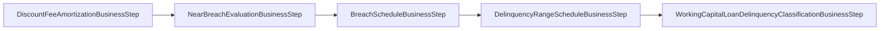

Working-capital loans run their own Close-of-Business (COB) pipeline,
distinct from the standard `LoanCOB`. The job iterates over active
`WorkingCapitalLoan` instances and applies a fixed sequence of
`WorkingCapitalLoanCOBBusinessStep` implementations. This page documents
each step, its preconditions, and the order in which they run.

The operational view (how to enable / disable the job, restart it, page
through partitions) lives at
[Working capital COB](/cob/working-capital-cob).

## The step base class

All WC steps extend the abstract:

```java
package org.apache.fineract.cob.workingcapitalloan.businessstep;

public abstract class WorkingCapitalLoanCOBBusinessStep
        implements COBBusinessStep<WorkingCapitalLoan> {}
```

This narrows the generic `COBBusinessStep<T>` to `WorkingCapitalLoan`, so
the COB framework only routes WC loans through these steps. The class
itself adds no behaviour — it's a marker that lets Spring discover the
right steps for the WC job.

## The six steps

The module ships six business steps, all under
`fineract-working-capital-loan/src/main/java/org/apache/fineract/cob/workingcapitalloan/businessstep/`:

<CardGroup cols={2}>
  <Card title="DiscountFeeAmortizationBusinessStep" icon="receipt">
    Recognises a daily slice of any up-front discount fee charged at
    origination. Skips loans without a discount fee or before
    disbursement.
  </Card>
  <Card title="NearBreachEvaluationBusinessStep" icon="triangle-exclamation">
    Evaluates the soft (near-breach) utilization threshold. Requires the
    facility to be `ACTIVE` and the product to have a near-breach
    configured.
  </Card>
  <Card title="BreachScheduleBusinessStep" icon="circle-exclamation">
    Re-runs the hard breach calculation. Marks the loan in breach,
    applies any configured breach fee, and emits the breach event.
  </Card>
  <Card title="DelinquencyRangeScheduleBusinessStep" icon="clock">
    Updates the delinquency range based on the worst overdue tranche.
    Uses the shared `DelinquencyBucket` engine.
  </Card>
  <Card title="WorkingCapitalLoanDelinquencyClassificationBusinessStep" icon="layer-group">
    Classifies the loan into the resulting delinquency range and emits
    the classification-change event.
  </Card>
  <Card title="DummyBusinessStep" icon="circle-dot">
    A no-op step kept in the module as a copy-paste template for
    contributors adding new steps. Disabled by default in production
    configurations.
  </Card>
</CardGroup>

## Step order

The COB job orders steps via the database-backed `BatchBusinessStep`
configuration. The shipped default ordering is:



The ordering matters:

<Steps>
  <Step title="Amortize first">
    Discount fee amortization changes the recognized income for the day.
    Running it first ensures downstream accrual + delinquency checks see
    the post-amortization state.
  </Step>
  <Step title="Soft threshold before hard">
    `NearBreachEvaluationBusinessStep` runs before
    `BreachScheduleBusinessStep` so that a facility crossing both
    thresholds in one day raises the near-breach event first, then the
    breach event — the order operators expect on the audit timeline.
  </Step>
  <Step title="Range before classification">
    `DelinquencyRangeScheduleBusinessStep` computes which range the
    worst tranche falls into; `WorkingCapitalLoanDelinquencyClassificationBusinessStep`
    persists the new classification and emits the event.
  </Step>
</Steps>

## Step-by-step detail

### DiscountFeeAmortizationBusinessStep

<Info>
  Discount fees in WC loans are debited at origination but recognised as
  income across the facility's life. This step performs the daily
  straight-line accrual using the facility's day-count convention.
</Info>

It runs only when:
- A tranche has actually been disbursed (`actualDisbursementDate != null`).
- The facility carries a non-zero discount fee.
- The current business date falls within the facility's amortization
  window.

The amortized amount is posted as an income journal entry via the
accounting subsystem.

### NearBreachEvaluationBusinessStep

```java
@Override
public WorkingCapitalLoan execute(final WorkingCapitalLoan loan) {
    if (!loan.getLoanStatus().isActive()) { return loan; }
    final WorkingCapitalLoanProductRelatedDetails details = loan.getLoanProductRelatedDetails();
    if (details == null || details.getNearBreach() == null) { return loan; }
    nearBreachEvaluationService.evaluate(loan, DateUtils.getBusinessLocalDate());
    return loan;
}
```

Delegates the actual evaluation to `WorkingCapitalLoanNearBreachEvaluationService`,
which projects utilization over the period and compares against the
configured `WorkingCapitalNearBreach`. The service is responsible for
emitting the `NEAR_BREACH_DETECTED` business event when the threshold is
crossed for the first time on this run.

### BreachScheduleBusinessStep

The hard-threshold counterpart. Requires:

- At least one tranche actually disbursed.
- A `WorkingCapitalBreach` on the active product details.

When triggered, it calls `WorkingCapitalLoanBreachScheduleService` to:

<Steps>
  <Step title="Project utilization">
    Build a daily utilization curve using the
    [embeddable progressive schedule generator](/progressive-loan/embeddable-schedule-generator).
  </Step>
  <Step title="Identify breach span">
    Walk the curve to find days where utilization exceeds the threshold.
  </Step>
  <Step title="Apply grace period">
    Subtract the configured `gracePeriod` from the breach span before
    deciding whether to classify the facility as in breach.
  </Step>
  <Step title="Apply breach fee">
    If a `feeAmount` or `feePercent` is configured, post the fee through
    the standard charge subsystem.
  </Step>
  <Step title="Update state and emit event">
    Set the loan's breach status, persist, and emit `BREACH_DETECTED` or
    `BREACH_CLEARED`.
  </Step>
</Steps>

### DelinquencyRangeScheduleBusinessStep

Re-computes which `DelinquencyRange` the facility's worst tranche falls
into. For a revolving facility "worst tranche" is the one with the
oldest still-unpaid installment. Reuses the core delinquency engine —
nothing WC-specific in the math; only the input curation is different.

### WorkingCapitalLoanDelinquencyClassificationBusinessStep

Writes the chosen range to the loan, updates audit columns, and emits
`DELINQUENCY_RANGE_CHANGED` when the value actually changes. Idempotent
when nothing changed.

### DummyBusinessStep

Used by contributors as a smoke test. Production deployments typically
disable it via `job_step` configuration.

## Failure modes and idempotency

<Warning>
  Every step must be safe to re-run on the same business date. The job
  framework will retry failed partitions; non-idempotent steps will
  double-post fees or double-emit events.
</Warning>

The shipped steps are written to that contract:

- **Idempotency keys** — Breach and near-breach state changes write a
  detection date so a re-run skips work that already happened today.
- **Side-effect ordering** — Each step persists, then emits. The
  business event publisher in this module flushes only on transaction
  commit, so an aborted run never emits dangling events.
- **Skip-without-error** — Preconditions return the input loan
  unchanged. A misconfigured loan slows the batch but never fails it.

## Wiring custom steps

To add a new step:

<Steps>
  <Step title="Extend the base class">
    `extends WorkingCapitalLoanCOBBusinessStep`. Implement `execute`.
  </Step>
  <Step title="Register as a Spring component">
    Annotate `@Component`. The COB job discovery picks it up by type.
  </Step>
  <Step title="Add a job_step row">
    Insert a row in `m_job_step` for the working-capital-loan job
    naming your class, with the desired ordering. Existing rows show the
    pattern.
  </Step>
  <Step title="Wire idempotency">
    Decide what makes a re-execution a no-op. Persist a date or a
    boolean on the loan, or skip when the day's effect has already been
    recorded.
  </Step>
</Steps>

## Observability

Each step emits structured logs around `execute(...)` — `DEBUG` for the
skip paths shown above, `INFO` for state changes, `WARN` for unexpected
input. The shared COB framework adds correlation IDs and partition
metadata.

<Tip>
  When a WC COB run "did nothing", grep for the loan ID at DEBUG. Every
  step's skip condition logs a line, so you can tell instantly which
  precondition kept the work from running.
</Tip>

## Related pages

<CardGroup cols={2}>
  <Card title="Working capital overview" href="/working-capital/overview" icon="briefcase" />
  <Card title="Product & Breach" href="/working-capital/product-and-breach" icon="sliders" />
  <Card title="Working capital COB" href="/cob/working-capital-cob" icon="calendar" />
  <Card title="COB framework" href="/cob/overview" icon="rotate" />
</CardGroup>
