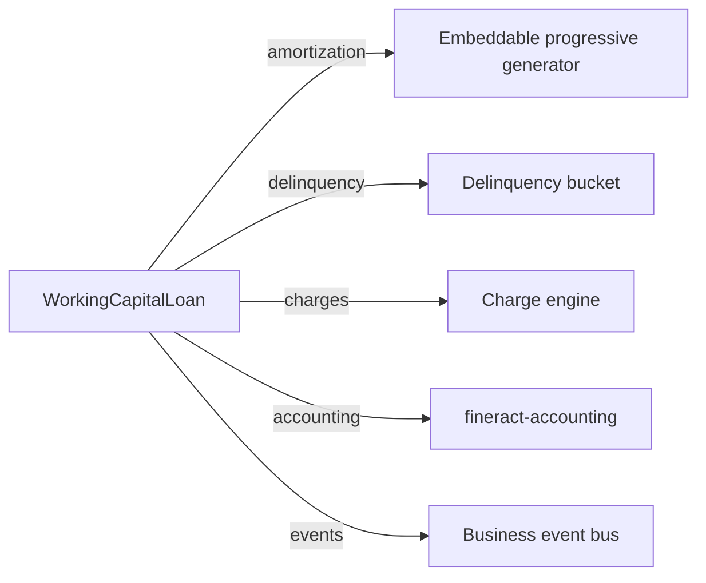

The `fineract-working-capital-loan` module adds a dedicated product
family for **short-term revolving credit** on top of Fineract's loan
core. Where a standard loan is single-disbursement / fixed-term,
working-capital loans look more like a line of credit: customers draw
against a limit, repay, and redraw, while the platform tracks utilization
and reacts to *breach* (over-limit) and *near-breach* (close-to-limit)
conditions.

The module is *parallel* to `fineract-loan` — it doesn't extend the
standard `LoanProduct`. Instead it owns its own product
(`WorkingCapitalLoanProduct`), its own loan entity (`WorkingCapitalLoan`),
its own COB pipeline (`WorkingCapitalLoanCOBBusinessStep` subclasses), and
its own business events. Where it overlaps with vanilla loans — for
amortization math, schedule generation, delinquency classification — it
delegates to the existing infrastructure.

## Package layout

```text
fineract-working-capital-loan/src/main/java/org/apache/fineract/
├── cob/
│   ├── api/                              # COB endpoints for WC
│   ├── domain/
│   ├── internal/
│   └── workingcapitalloan/businessstep/  # Six WC-specific COB steps
├── infrastructure/event/business/
│   └── domain/workingcapitalloan/
│       └── transaction/                  # Business events
└── portfolio/
    ├── workingcapitalloan/               # Loan entity + lifecycle
    ├── workingcapitalloanbreach/         # Breach configuration entity
    ├── workingcapitalloannearbreach/     # Near-breach configuration entity
    └── workingcapitalloanproduct/        # Product entity + payment allocation
```

The split between `workingcapitalloanbreach` and
`workingcapitalloannearbreach` mirrors the way the product references two
*independent* threshold definitions — see
[Product & Breach](/working-capital/product-and-breach).

## Conceptual model

<CardGroup cols={2}>
  <Card title="Revolving credit" icon="recycle">
    Customers draw and repay multiple times against a single facility
    limit. Each draw becomes a `WorkingCapitalLoanDisbursementDetails`
    record on the parent `WorkingCapitalLoan`.
  </Card>
  <Card title="Utilization" icon="gauge">
    The ratio of outstanding principal (across all open disbursements)
    to the facility limit. Tracked continuously and re-evaluated daily
    by the COB pipeline.
  </Card>
  <Card title="Near-breach / Breach" icon="triangle-exclamation">
    Two-tier alerting. Near-breach fires when utilization crosses a
    soft threshold (e.g. 90% of limit). Breach fires when it goes over
    the hard limit. Both are configured on the product.
  </Card>
  <Card title="Discount fee amortization" icon="receipt">
    Many WC products charge an up-front discount fee that has to be
    amortized over the facility period rather than recognised on draw.
    A dedicated COB step performs the daily accrual.
  </Card>
</CardGroup>

## Relationship to the loan core

`WorkingCapitalLoan` is **not** a subclass of `Loan` — it is a sibling
entity. Where amortization is needed (for instance to project a tranche
through to maturity for breach calculation), the module calls into the
[embeddable progressive schedule generator](/progressive-loan/embeddable-schedule-generator).
Where delinquency classification, holiday handling, currency math, and
charge mechanics are needed, it depends on the same domain objects the
core loan module uses (`MonetaryCurrency`, `Money`, `DelinquencyBucket`,
`Fund`).



## Key domain entities

<AccordionGroup>
  <Accordion title="WorkingCapitalLoanProduct">
    The product definition. Holds the facility currency, accounting type,
    delinquency bucket, fund, optional **breach** and **near-breach**
    references, term variations, payment allocation rules, and start/close
    dates. See
    [Product & Breach](/working-capital/product-and-breach).
  </Accordion>
  <Accordion title="WorkingCapitalLoanProductRelatedDetails">
    Embedded value object on the product carrying tenor, interest method,
    repayment frequency, amortization type, and the active links to
    breach / near-breach. Cloned onto each `WorkingCapitalLoan` so a
    facility's terms remain stable even if the product is later updated.
  </Accordion>
  <Accordion title="WorkingCapitalLoan">
    The facility. Owns a collection of
    `WorkingCapitalLoanDisbursementDetails` (each tranche / draw) plus a
    `WorkingCapitalLoanProductRelatedDetails` snapshot. Status flows
    through SUBMITTED → APPROVED → ACTIVE → CLOSED via the standard
    `LoanStatus` enum.
  </Accordion>
  <Accordion title="WorkingCapitalBreach / WorkingCapitalNearBreach">
    Separately persisted threshold definitions. Each carries an
    `amountCalculationType` (`AMOUNT` vs `PERCENTAGE`) and the trigger
    value. A product references one of each.
  </Accordion>
  <Accordion title="Business events">
    `infrastructure.event.business.domain.workingcapitalloan.transaction`
    holds the dedicated business events emitted on WC lifecycle changes
    (disbursement, repayment, breach detection). They flow through the
    same event publisher the core uses.
  </Accordion>
</AccordionGroup>

## The lifecycle in brief

<Steps>
  <Step title="Product authored">
    Operators create a `WorkingCapitalLoanProduct`, pointing at fund,
    delinquency bucket, breach and near-breach definitions, and payment
    allocation rules. See
    [Product & Breach](/working-capital/product-and-breach).
  </Step>
  <Step title="Facility submitted and approved">
    A client / group submits an application referencing the product. The
    submission validator (in `validator/`) checks limit, frequency, and
    breach references. Approval transitions the loan to `APPROVED`.
  </Step>
  <Step title="First disbursement">
    A `WorkingCapitalLoanDisbursementDetails` is added with an
    `actualDisbursementDate`. The facility moves to `ACTIVE`. The
    embeddable progressive generator projects the schedule used for
    breach calculation downstream.
  </Step>
  <Step title="Day-to-day operation">
    Subsequent draws and repayments adjust outstanding utilization. The
    [COB pipeline](/working-capital/cob-pipeline) runs once a day to
    refresh fee amortization, breach classification, near-breach
    evaluation, and delinquency.
  </Step>
  <Step title="Closure">
    When the facility's `closeDate` is reached and outstanding is zero,
    the COB pipeline closes the loan and emits the closure event.
  </Step>
</Steps>

## Where to read next

<CardGroup cols={2}>
  <Card title="Product & Breach" href="/working-capital/product-and-breach" icon="sliders">
    Product fields, breach calculation, near-breach evaluation logic.
  </Card>
  <Card title="COB Pipeline" href="/working-capital/cob-pipeline" icon="rotate">
    The six dedicated COB steps and the order they run in.
  </Card>
  <Card title="Working capital COB" href="/cob/working-capital-cob" icon="calendar">
    Operational view of the WC COB job.
  </Card>
  <Card title="Embeddable generator" href="/progressive-loan/embeddable-schedule-generator" icon="puzzle-piece">
    The schedule projection engine WC uses for breach forecasting.
  </Card>
</CardGroup>

<Tip>
  When investigating a WC loan's behaviour, always start with its
  `WorkingCapitalLoanProductRelatedDetails` snapshot — not the product.
  The snapshot is what governs the running facility; the product can have
  drifted since approval.
</Tip>

## Module activation

Like other optional modules, working capital is guarded by a property:

```properties
fineract.module.working-capital-loan.enabled=true
```

When `false`, all `@Service` beans in the module are conditionally
skipped, the WC COB business steps are not registered, and the REST
endpoints under `/workingcapitalloans` return 404. The module's domain
classes are still on the classpath, so existing rows remain readable —
they just don't get touched by COB.

## See also

<CardGroup cols={2}>
  <Card title="Loan core" href="/loan/loan-product" icon="building-columns" />
  <Card title="Delinquency" href="/loan/loan-delinquency" icon="clock" />
  <Card title="COB framework" href="/cob/overview" icon="rotate" />
  <Card title="Business events" href="/events/business-events" icon="bolt" />
</CardGroup>

## Persistence schema highlights

The module ships its own schema under the `m_wc_*` prefix:

| Table | Contents |
| --- | --- |
| `m_wc_loan_product` | Product master |
| `m_wc_loan_product_payment_allocation` | One row per allocation rule per transaction type |
| `m_wc_loan` | Facility-level loan record |
| `m_wc_loan_disbursement_details` | Each draw against the facility |
| `m_wc_loan_breach` | Hard threshold definitions |
| `m_wc_loan_near_breach` | Soft threshold definitions |
| `m_wc_loan_breach_event` | Audit trail of breach detection runs |

The naming convention mirrors `fineract-loan`'s `m_loan_*` tables, so
joins for cross-cutting reports stay readable.

## REST surface

API resources live under `portfolio/workingcapitalloan*/api/`:

| Path | Purpose |
| --- | --- |
| `/workingcapitalloanproducts` | Product CRUD |
| `/workingcapitalloans` | Facility CRUD + lifecycle commands |
| `/workingcapitalloanbreach` | Breach catalog |
| `/workingcapitalloannearbreach` | Near-breach catalog |

All operations use the standard Fineract command framework, with audit
columns populated by the same `AbstractAuditableWithUTCDateTimeCustom`
base used elsewhere. Swagger docs are auto-generated from the
`*ApiResourceSwagger` classes that sit alongside each resource.

<Tip>
  When integrating a working-capital product with a front office, model
  it as a single facility per borrower-product pair. The
  `WorkingCapitalLoan` aggregate already handles multiple draws,
  partial repayments, and overlapping tranches — there is no need to
  open a new "loan" per draw.
</Tip>

## Accounting integration

Working-capital facilities post journal entries through the same
`fineract-accounting` channel as core loans. The
`WorkingCapitalAccountingRuleType` enum controls the posting style:

| Value | Effect |
| --- | --- |
| `NONE` | No accounting integration — useful for tenant-managed external GLs. |
| `CASH` | Cash basis — posts at transaction time. |
| `ACCRUAL_PERIODIC` | Accrual basis with daily accrual run as part of COB. |
| `ACCRUAL_UPFRONT` | Recognises interest immediately on schedule generation; rarely used. |

Discount-fee amortization, breach-fee assessment, and standard
repayment postings all honour the chosen rule. The relevant accounting
mappings sit under `portfolio/workingcapitalloan/accounting/`.

## Business events

The `infrastructure/event/business/domain/workingcapitalloan/`
subpackage owns events such as:

- `WorkingCapitalLoanCreatedBusinessEvent`
- `WorkingCapitalLoanApprovedBusinessEvent`
- `WorkingCapitalLoanDisbursedBusinessEvent`
- `WorkingCapitalLoanBreachDetectedBusinessEvent`
- `WorkingCapitalLoanNearBreachDetectedBusinessEvent`
- `WorkingCapitalLoanClosedBusinessEvent`

Plus transaction-level events under the `transaction/` sub-package for
each repayment, refund, charge-off and write-off. Subscribers register
through the standard event listener mechanism — no WC-specific bus.
