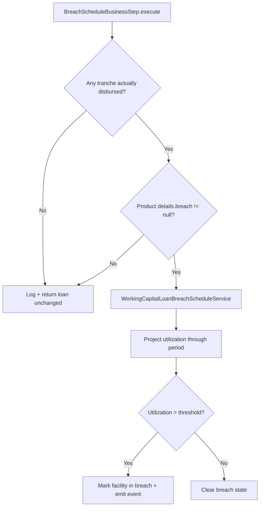

A working-capital loan's behaviour is almost entirely governed by its
**product**. This page documents `WorkingCapitalLoanProduct`, the embedded
`WorkingCapitalLoanProductRelatedDetails`, and the two threshold entities
— `WorkingCapitalBreach` and `WorkingCapitalNearBreach` — that drive
breach classification during COB.

## WorkingCapitalLoanProduct

Defined at
`fineract-working-capital-loan/src/main/java/org/apache/fineract/portfolio/workingcapitalloanproduct/domain/WorkingCapitalLoanProduct.java`.
Table `m_wc_loan_product` with unique constraints on `name`, `short_name`,
and `external_id`.

### Top-level fields

| Field | Type | Notes |
| --- | --- | --- |
| `name` | String, required | Display name. |
| `shortName` | String, required | Unique short code. |
| `externalId` | ExternalId | Optional external system identifier. |
| `fund` | Fund (FK) | Funding source. Shared with core loans. |
| `delinquencyBucket` | DelinquencyBucket (FK) | Reused from core. |
| `breach` | WorkingCapitalBreach (FK) | Hard utilization threshold. |
| `nearBreach` | WorkingCapitalNearBreach (FK) | Soft utilization threshold. |
| `startDate` / `closeDate` | LocalDate | When the product is sellable. |
| `description` | String | Free text. |
| `accountingRule` | `WorkingCapitalAccountingRuleType` | `NONE`, `CASH`, `ACCRUAL_PERIODIC`, `ACCRUAL_UPFRONT`. |
| `relatedDetail` | embedded | See below. |

### WorkingCapitalLoanProductRelatedDetails

Embedded value object carrying tenor, interest, and amortization
configuration:

<ParamField path="currency" type="MonetaryCurrency" required>
  Facility currency. All disbursements and repayments share this.
</ParamField>

<ParamField path="amortizationType" type="WorkingCapitalAmortizationType">
  `EQUAL_INSTALLMENTS` or `EQUAL_PRINCIPAL`.
</ParamField>

<ParamField path="interestMethod" type="InterestMethod" required>
  Usually `PROGRESSIVE`. WC products lean on the
  [embeddable progressive generator](/progressive-loan/embeddable-schedule-generator)
  for projection.
</ParamField>

<ParamField path="interestCalculationPeriod" type="enum">
  `DAILY` is the only supported value for progressive WC products.
</ParamField>

<ParamField path="repaymentEvery" type="int" required>
  Repayment frequency multiplier paired with `repaymentPeriodFrequencyType`.
</ParamField>

<ParamField path="repaymentPeriodFrequencyType" type="PeriodFrequencyType">
  `DAYS`, `WEEKS`, or `MONTHS`.
</ParamField>

<ParamField path="numberOfRepayments" type="int" required>
  Total installments per tranche.
</ParamField>

<ParamField path="nominalAnnualInterestRate" type="BigDecimal" required>
  Quoted rate. Applied via the progressive interest model.
</ParamField>

<ParamField path="delinquencyStartType" type="WorkingCapitalLoanDelinquencyStartType">
  `OVERDUE_DAYS` vs `OVERDUE_FROM_DUE_DATE` — controls when the
  delinquency clock starts ticking on a missed installment.
</ParamField>

<ParamField path="breach" type="WorkingCapitalBreach">
  Resolved from the product's breach FK. Cloned onto the facility at
  approval so it can't drift.
</ParamField>

<ParamField path="nearBreach" type="WorkingCapitalNearBreach">
  Same pattern for the soft threshold.
</ParamField>

<Note>
  `WorkingCapitalLoanProductConfigurableAttributes` flags whether tenant
  operators can override each field per loan. The validator consults it
  during submission.
</Note>

### Payment allocation rules

WC products carry their own
`WorkingCapitalLoanProductPaymentAllocationRule` (parsed by
`WorkingCapitalAdvancedPaymentAllocationsJsonParser`). The rule shape is
identical to the progressive loan core rule — see the
[progressive loan product](/progressive-loan/progressive-loan-product)
page — and the same `WorkingCapitalPaymentAllocationType` enum drives the
processor.

## Breach entities

### WorkingCapitalBreach

Defined in
`portfolio.workingcapitalloanbreach.domain.WorkingCapitalBreach`. A
breach record holds:

| Field | Purpose |
| --- | --- |
| `name` / `description` | Operator-facing labels. |
| `amountCalculationType` | `AMOUNT` or `PERCENTAGE` — see below. |
| `value` | The threshold itself (currency amount or percent of limit). |
| `gracePeriod` | Days of grace before classification escalates. |
| `feeAmount` / `feePercent` | Optional breach-fee configuration. |

### WorkingCapitalNearBreach

Same shape, mounted as a soft warning. Surfaces in dashboards and emits a
business event but does not (by itself) trigger a breach fee.

### WorkingCapitalBreachAmountCalculationType

```java
public enum WorkingCapitalBreachAmountCalculationType {
    AMOUNT,      // value is an absolute currency amount
    PERCENTAGE   // value is a fraction (0..100) of facility limit
}
```

## How breach detection runs

Detection happens inside the dedicated COB step
`BreachScheduleBusinessStep`
(`cob/workingcapitalloan/businessstep/BreachScheduleBusinessStep.java`).
The simplified flow:



Key implementation details from the step:

```java
@Override
public WorkingCapitalLoan execute(final WorkingCapitalLoan input) {
    final boolean isDisbursed = input.getDisbursementDetails().stream()
            .map(WorkingCapitalLoanDisbursementDetails::getActualDisbursementDate)
            .anyMatch(Objects::nonNull);
    if (!isDisbursed) { /* skip */ }

    final WorkingCapitalLoanProductRelatedDetails details = input.getLoanProductRelatedDetails();
    if (details == null || details.getBreach() == null) { /* skip */ }

    // delegate to WorkingCapitalLoanBreachScheduleService
    ...
}
```

The service materialises the projected utilization curve (using the
embeddable generator on each open tranche), evaluates the threshold per
day, and writes back the resulting breach state plus any breach fee.

## Near-breach evaluation

`NearBreachEvaluationBusinessStep` mirrors the breach step but uses the
*soft* threshold. The key differences:

- The step requires the loan to be in `ACTIVE` status — submitted /
  pending loans never raise a soft warning.
- The result is purely informational — a flag on the loan and an event,
  not a fee.
- It runs **before** `BreachScheduleBusinessStep` so dashboards see the
  warning the same day a breach is recorded.

```java
@Override
public WorkingCapitalLoan execute(final WorkingCapitalLoan loan) {
    if (!loan.getLoanStatus().isActive()) { /* skip */ }
    final WorkingCapitalLoanProductRelatedDetails details = loan.getLoanProductRelatedDetails();
    if (details == null || details.getNearBreach() == null) { /* skip */ }
    nearBreachEvaluationService.evaluate(loan, DateUtils.getBusinessLocalDate());
    return loan;
}
```

## Threshold examples

<Tabs>
  <Tab title="Percentage breach">
    ```json
    {
      "name": "Hard cap 110%",
      "amountCalculationType": "PERCENTAGE",
      "value": 110.00,
      "gracePeriod": 0,
      "feePercent": 2.50
    }
    ```
    Triggers when utilization exceeds 110% of facility limit. Charges a
    2.5% breach fee on the excess.
  </Tab>
  <Tab title="Absolute breach">
    ```json
    {
      "name": "Cap at 500k",
      "amountCalculationType": "AMOUNT",
      "value": 500000,
      "gracePeriod": 3,
      "feeAmount": 1000
    }
    ```
    Fixed-currency limit with a three-day grace before fees apply.
  </Tab>
  <Tab title="Near-breach companion">
    ```json
    {
      "name": "Soft warning 90%",
      "amountCalculationType": "PERCENTAGE",
      "value": 90.00
    }
    ```
    Informational only — no fees, no grace period.
  </Tab>
</Tabs>

## Validation

`WorkingCapitalAdvancedPaymentAllocationsValidator` enforces the
payment-allocation shape. The product validator (in
`workingcapitalloanproduct/service`) additionally checks:

<Steps>
  <Step title="Threshold pair consistency">
    If both breach and near-breach use `PERCENTAGE`, the near-breach
    value must be strictly less than the breach value.
  </Step>
  <Step title="Currency coherence">
    `AMOUNT`-type thresholds and breach fees must use the same currency
    as the product.
  </Step>
  <Step title="Date ordering">
    `startDate <= closeDate` on the product; thresholds inherit the
    product's active window.
  </Step>
</Steps>

## Cross-references

<CardGroup cols={2}>
  <Card title="WC overview" href="/working-capital/overview" icon="briefcase" />
  <Card title="COB pipeline" href="/working-capital/cob-pipeline" icon="rotate" />
  <Card title="Working capital COB job" href="/cob/working-capital-cob" icon="calendar" />
  <Card title="Delinquency" href="/loan/loan-delinquency" icon="clock" />
</CardGroup>

<Warning>
  Updating a `WorkingCapitalBreach` row affects *new* facilities only.
  Live facilities continue to use the breach configuration cloned into
  their `WorkingCapitalLoanProductRelatedDetails`. Reissue the facility
  if you need to change the in-force threshold.
</Warning>
